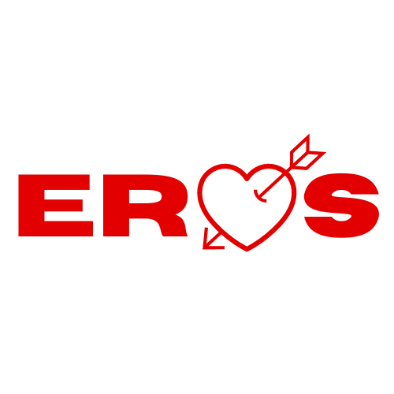
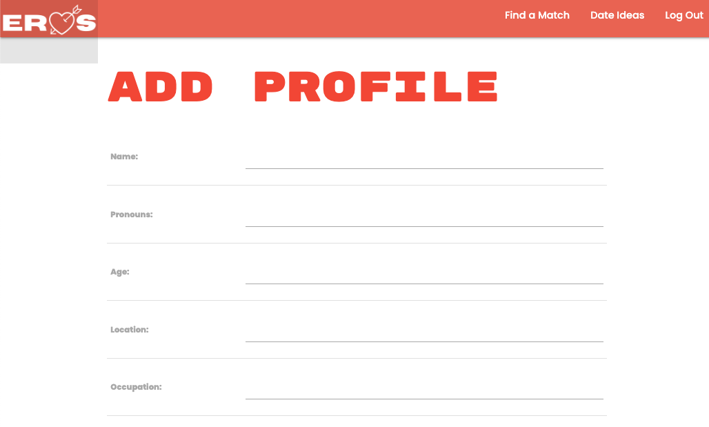
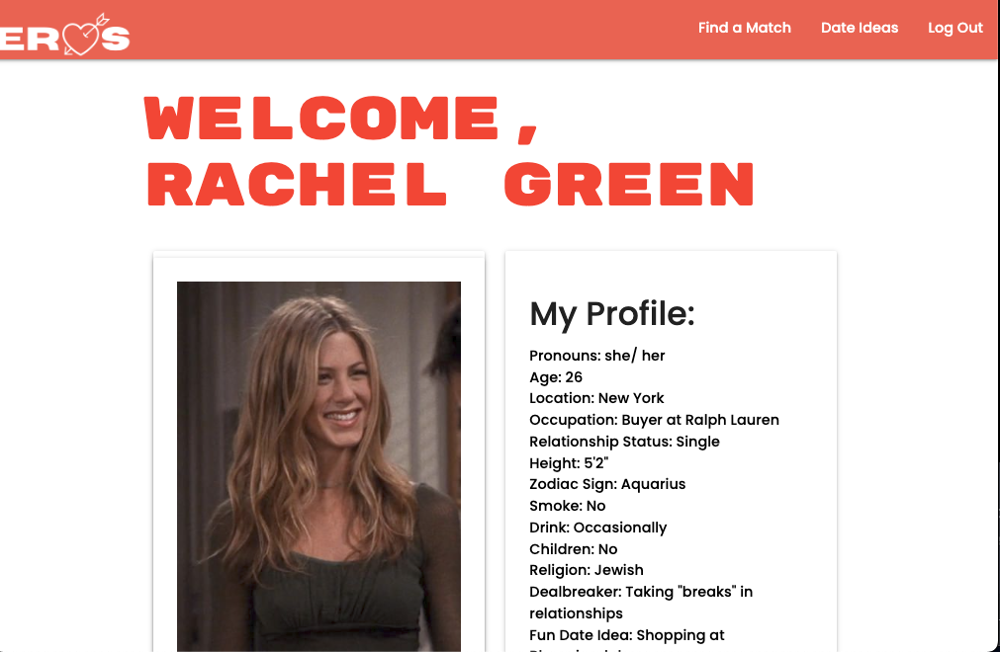
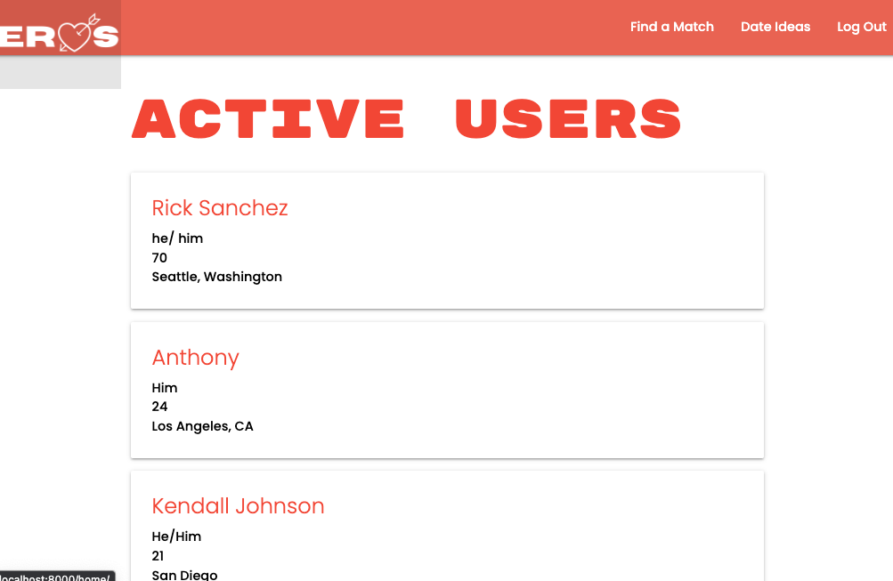
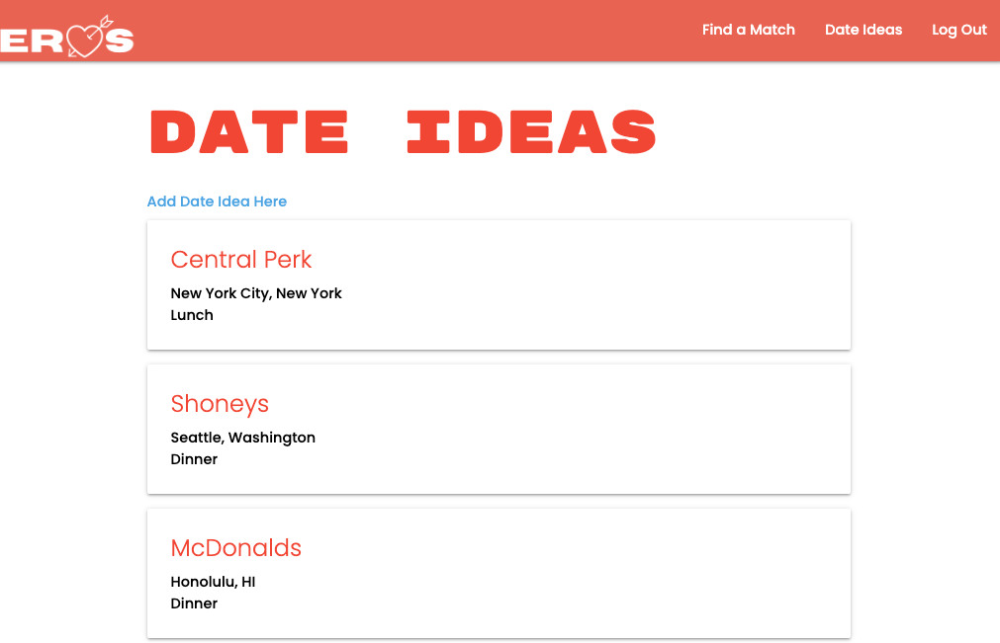

# eros

#[LIVE DEMO HERE](https://eros.herokuapp.com/)

# Introduction
Eros is a dating app that allows users to create date ideas to share with other users. 

## How It Works

Users will fill out a profile form upon sign up to create a profile. It will take the user to their homepage that shows their profile information, and prompt them to also upload a profile photo.

Here is an example of what the profile homepage may look like. It will also show the user's potential matches, as well as the option to delete their profile.

All of the registered users are listed here. Clicking on a user opens up their profile that resembles the homepage. On the user's detail page, there is an option to add a user to your potential matches. Adding a user will redirect you to the date ideas page.

All of the existing date ideas are listed here. Clicking on the date idea opens up the details page of that date. In the details, it links the user to the creator of that date.

# Technologies Used
- Django
- Bit.io
- Heroku
- AWS

## Getting Started
- [Trello](https://trello.com/invite/b/8RvSJHk7/ATTI0c8709e2880d8886c640cae26546c38623E4EE1B/eros)
- [Wireframe](https://whimsical.com/project-4-UwTqjgYaoEz7P9aVjdxSc1)
- [ERD](https://lucid.app/lucidchart/6e346572-0f46-42f6-83fa-4d4d39894d09/edit?viewport_loc=56%2C210%2C896%2C526%2C0_0&invitationId=inv_2fcd580c-ef8a-4478-b6b6-4b6c29838209)

## Next Steps
1. Resolve CSS inconsistencies between my local app and deployed app
2. Implement an api that allows users to select date locations from a map
3. Allow users to swipe and actually match with each other
4. Implement a chat function so users may chat with each other
